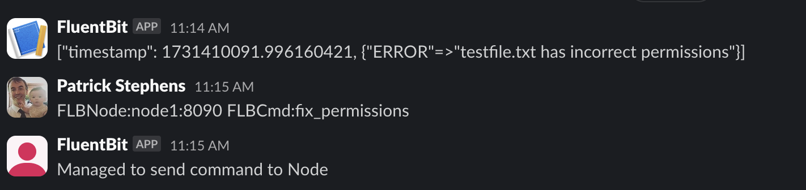

# Introduction

This repository was used as the basis for two talks at [Cloud Native Rejects Paris 2024](https://cfp.cloud-native.rejekts.io/cloud-native-rejekts-eu-paris-2024/talk/LXXPWR/) and [Open Source Monitoring Conference 2024](https://osmc.de/talks/fluent-bit-the-engine-to-power-chat-ops/).

The demo for [Cloud Native Rejects Paris 2024 talk](https://cfp.cloud-native.rejekts.io/cloud-native-rejekts-eu-paris-2024/talk/review/PP8T37LPQUSTTRWBXVCHFJSSKDM9B98J).

The [actual presentation is available in this repo](./docs/Fluent_Bit_for_ChatOps-Cloud_Native_Rejekts_EU_2024.pdf).

Videos covering the demo are here:

* [Demo](https://chronosphere-io.zoom.us/rec/share/acwg8ZR0Laoj7p9GlzBWSmJRTEXoNlGicYIxNPNKvVsey6NvtU44oiReTbmHKWMf.8GMEIpjA2d5pX5rZ?startTime=1710415864000&pwd=LGnKSo-mzFXroR5H04BcVUmoWRFzge4f)
* [Code overview](https://chronosphere-io.zoom.us/rec/share/acwg8ZR0Laoj7p9GlzBWSmJRTEXoNlGicYIxNPNKvVsey6NvtU44oiReTbmHKWMf.8GMEIpjA2d5pX5rZ?startTime=1710416213000&pwd=LGnKSo-mzFXroR5H04BcVUmoWRFzge4f)

This contains all the resources to build a demo-able ChatOps solution using Slack and Fluent Bit.

* all the details are in the [docs](./docs/readme.md) and the specific build docs are in [docs/buildme.md](./docs/buildme.md)
* [fluent-bit-config](./fluent-bit-config/) has the Fluent Bit configuration
* [src](./src/) with all the Java code build with [Helidon](https://helidon.io/).

Create a `.env` file with the following secrets/config set up:

```shell
SLACK_TOKEN=xoxb-XXX
SLACK_CHANNEL_ID=XXX
SLACK_CHANNEL_NAME=XXX
SLACK_WEBHOOK=https://hooks.slack.com/services/XXX

OPS_RETRYINTERVAL=10
OPS_RETRYCOUNT=18
TESTFLB=FALSE
SYNTH_ALERT_PORT=
```

Once this is done, just run up `docker compose up` to start sending an alert and responding.

Once running, you will see a report of an issue like so and can tell it to fix it up:



Specify a command to run using the syntax `FLBNode:<Hostname>:<Port> FLBCmd:<Command>`, this syntax is arbitrary and just an example for usage in the demo.

```shell
FLBNode:node1:8090 FLBCmd:fix_permissions
```

The command will show you it is running (just a dummy here as an example):

```shell
node1-1              | [0] alert: [[1731410091.996160421, {}], {"ERROR"=>"testfile.txt has incorrect permissions"}]
...
http-slack-server-1  | 2024.11.12 11:15:24 INFO com.oracle.flb.chatops.FLBSocialCommandResource VirtualThread[#63,[0x4de53a24 0x79177571] WebServer socket]/runnable@ForkJoinPool-1-worker-4: Actioning:
http-slack-server-1  | {"isOk" : "true", "command":"fix_permissions", "FLBNode"="node1:8090"}
http-slack-server-1  | 2024.11.12 11:15:24 INFO com.oracle.flb.chatops.FLBSocialCommandResource VirtualThread[#63,[0x4de53a24 0x79177571] WebServer socket]/runnable@ForkJoinPool-1-worker-4: Thread : [0x4de53a24 0x79177571] WebServer socket ending <<<<<<<<<<<<<
node1-1              | [2024/11/12 11:15:24] [ info] [output:http:http.1] http-slack-server:8080, HTTP status=200
node1-1              | {postAlertNoId= 11-14-53}
node1-1              | {
node1-1              |   command = "fix_permissions",
node1-1              |   tagged = "11-14-53",
node1-1              |   time = "11-15-24",
node1-1              |   <metatable> = {
node1-1              |     type = 2
node1-1              |   }
node1-1              | }
node1-1              | Will execute fix_permissions
node1-1              | running: /fluent-bit/etc/cmd_fix_permissions.sh > /logs//remoteCommand.lua.out
node1-1              | [0] command: [[1731410124.293250380, {}], {"command"=>"fix_permissions", "time"=>"11-15-24", "tagged"=>"11-14-53"}]
node1-1              | [2024/11/12 11:15:24] [ info] [input:tail:tail.3] inotify_fs_add(): inode=2 watch_fd=1 name=/logs//remoteCommand.lua.out
node1-1              | [0] results: [[1731410124.999926256, {}], {"log"=>"chmod a+w testfile.txt"}]
...
```
