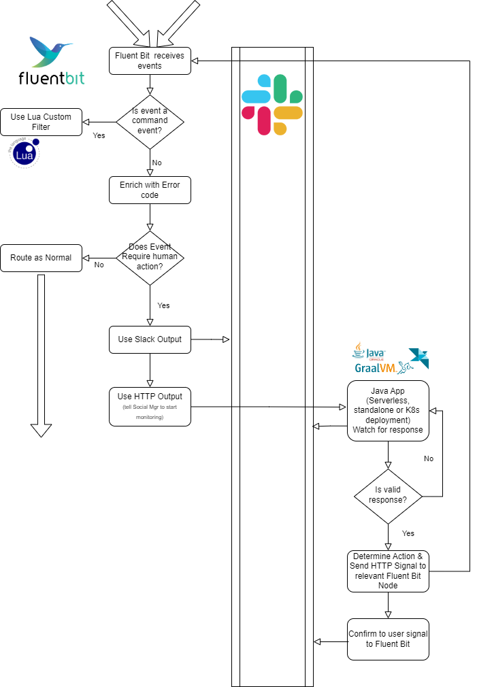
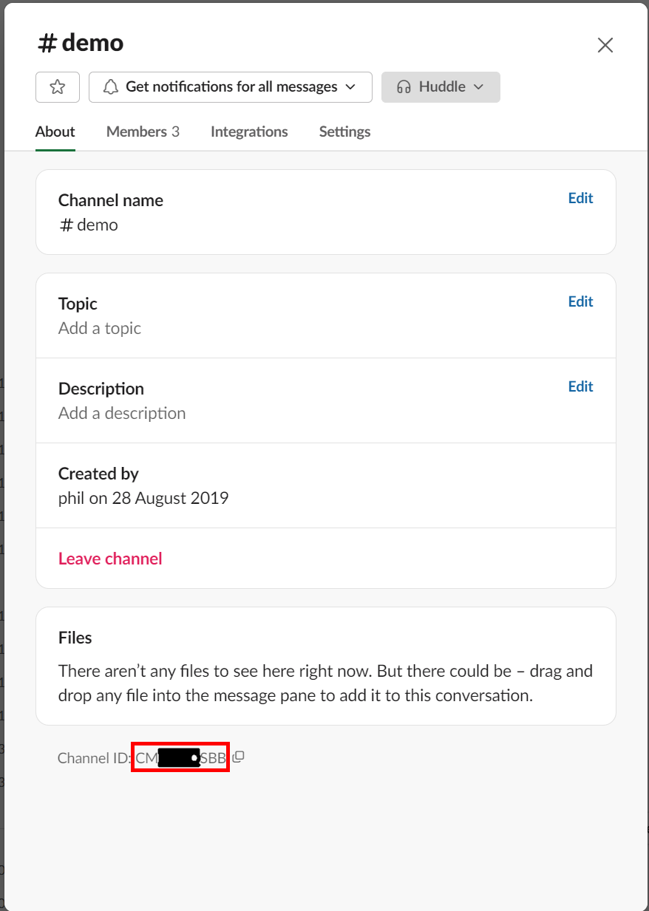

# Introduction

This documentation covers the build, configuration, and execution of the ChatOps demo using Slack and Fluent Bit.

This is an MVP to illustrate the possibility and explore the security considerations and implications.

*Note text in italics in the following documentation represents functionality not yet implemented.*

## Pre-requisites

To build and run the following demo, you'll need:

- Slack with admin privileges to:
  - create and configure an API token
  - Create a channel to communicate with Fluent Bit with
- Compute platform to run:
  - the Java/GraalVM application
  - one or more compute nodes to run Fluent Bit on (can be containers)
  - Log simulator/event generation capability
  - CURL for testing
- For building the Slack response handler
  - Maven for compiling the code
  - Java (ideally Java21 to benefit from the virtual thread optimizations)

## Solution

The solution operates in the following manner:



## Fluent Bit

Fluent Bit has two paths to handle:

1. Handling of normal events and identifying which event(s) may need to be shared via Slack for human intervention
2. Handling of the human action coming from Slack to execute a remediation operation. This comes as an HTTP event (*an enhancement to make things secure with SSL should be made available*)

The Fluent Bit resources for this all reside within the folder **../fluentbit**.

The Fluent Bit configuration currently makes use of the classic syntax and has the Lua scripting deployed alongside it.

A test script that will mimic the Slack handler call is provided, which makes use of CURL - called **test-cmd.[bat|sh]**

### Java/GraalVM Response Handler (aka Social Agent)

This has been built with the [Helidon](https://helidon.io/) framework so that the code can be *built to a native binary using [GraalVM](https://www.graalvm.org/)* for optimal performance and footprint or just run using Java (ideally Java21). Given the nature of the functionality, it could be deployed as a serverless solution (e.g., using *[OCI Functions](https://www.oracle.com/uk/cloud/cloud-native/functions/)*), a microservice in Kubernetes (such as [*OKE*](https://www.oracle.com/uk/cloud/cloud-native/container-engine-kubernetes/)), or a simple free-standing application.

Helidon provides by default its own simple app server and has been configured to generate metrics for the endpoints it supports - **/social**

The Java code is structured such that different implementations of the Social Channel could be implemented.

## Configuration Requirements

The app can take the following configuration information:

| Configuration Name | Description                                                  | Example / Default Value | Mandatory |
| ------------------ | ------------------------------------------------------------ | ----------------------- | --------- |
| OPS_RETRYINTERVAL  | The time between checking in with Slack to see if there is a command to processes. | 60                      |           |
| OPS_RETRYCOUNT     | The number of attempts to check in. So with a retry of 2 and an interval of 60 means that if the instruction for Fluent Bit isn't provided within 2 minutes then all conversations in Slack will be ignored. | 2                       |           |
| PORT               | The Port that the target Fluent Bit HTTP                     | 2020                    |           |
| SLACK_CHANNEL_ID   | This is the true channel ID, rather than the user-friendly channel name |                         | Y         |
| SLACK_CHANNEL_NAME | This is the user friendly name. Not implemented yet - but this can be used to obtain the channel ID. Currently defined to help differentiate the name and Id | myChannel               | N         |
| SLACK_TOKEN        | The token that will authenticate the app with Slack          | xoxb-XXXXXXX            | Y         |
| SLACKMSGLIMIT      |                                                              |                         |           |
| TESTFLB            | A boolean flag that, when set to true provides an additional URL that can be used. When enabled, we can invoke the URL `/social/testFLB` to trigger Fluent Bit as if an event had been identified.  The test makes use of the environment configuration values TESTFLB-COMMAND and TESTFLB_NODE. This makes it easier to test the associated script. |                         |           |
| TESTFLB_COMMAND    | This defines the command to be sent to Fluent Bit when TESTFLB is used | test                    | N         |
| TESTFLB_NODE       | This defines the FLB Node (including port number) of Fluent Bit when we want to mimic a detection. | 127.0.0.1:8090          | N         |
| TESTFLB_TAG        | When using TESTFLB option, this provides the tag to be used with the invocation back to Fluent Bit | command                 | N         |

## Detecting the Response

The agent is waiting for a response directed back to the agent e.g. t is then looking specifically looking for two value pairs in the response:

- **FLBCmd**:`<script name without the cmd_ prefix or the file extension>` e.g. test will trigger a script called `cmd_test.bat` or `cmd_test.sh`
- **FLBNode**:`<node address including port number>` Note if you use 127.0.0.1 then the social agent needs to be co-resident with the Fluent Bit node. Otherwise use the IP of Fluent Bit that is visible to the agent's deployment.

> **Note**: By only accepting the name of a script to execute, we prevent arbitrary scripts from being invoked. This represents a means to provide security, but the framework could easily be extended to supply a script if this was deemed acceptable.

When these values are identified in the response then an HTTP call to the node using the preconfigured port is invoked with a JSON payload in the following form:

```json
{\"cmd\":\"commandname\"}
```

*Rather than the node, we could address the node via an incident ID, which the response handler could then look up, having previously recorded it with the response handler.*

## Slack Setup Notes

The following relates to both Fluent Bit and the Social Agent configuration.  Using the provided Fluent Bit configuration means you'll need the following environment variables defined:

| Configuration Name | Description                                                  | Example / Default Value                         |
| ------------------ | ------------------------------------------------------------ | ----------------------------------------------- |
| SLACK_WEBHOOK      | This is needed by Fluent Bit's slack plugin. This is documented in the Slack APIS [here](https://api.slack.com/messaging/webhooks). | <https://hooks.slack.com/services/blah/blah/blah> |
| CHAT_OPS_SVR       | This is the address of the Social Agent so that we can nudge it when an event has been sent to Slack. `127.0.0.1` can be used if the Fluent Bit and social agent are co-resident. | 127.0.0.1                                       |
| CHAT_OPS_PORT      | The port to use for the messaging to the agent. This needs to be a numeric number | 8080                                            |

### Getting slack token

Setting up the token is described in the Slack API documentation [here](https://api.slack.com/tutorials/tracks/getting-a-token). The App needs to be deployed to the channel we're going to use for this operation.

The token needs to have various oauth permissions and an incoming webhook set up for the app.

The bot needs to be invited to the channel as well.

### Identifying the Slack Channel Id

The simplest way to identify the Slack channel's ID is in the UI to select the relevant channel and right-click. This will present the menu, which includes the option View Channel Details as shown in these screenshots. At the bottom of the channel details is the ID of the channel (highlighted with the red box).



